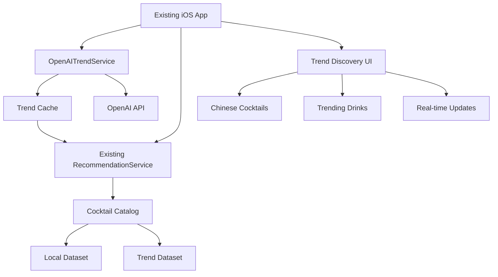
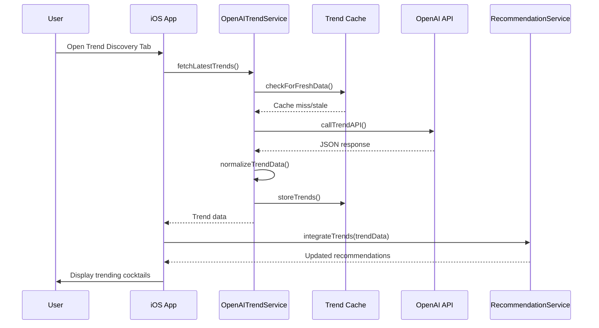
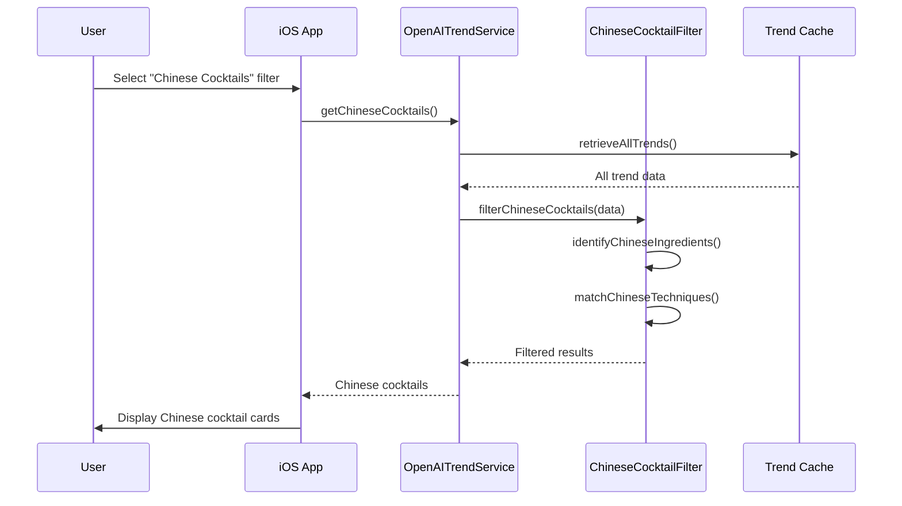

# Design Document: OpenAI Trend Integration for Cocktail Pantry iOS

## Overview

This design enhances the existing Cocktail Pantry iOS app with OpenAI integration to fetch trending drinks from the internet, discover new Chinese cocktails and trendy drinks, provide real-time trend tracking, and enhance the cocktail catalog with internet-sourced recipes. The integration will work alongside the existing local cocktail dataset, providing users with up-to-date drink trends while maintaining the core functionality of inventory-based recommendations.

## Architecture

The OpenAI integration extends the existing architecture with new services for trend fetching, content processing, and cache management. The system will periodically fetch trending cocktail data from OpenAI's API, process it into the app's normalized format, and integrate it with the existing recommendation engine.



## Sequence Diagrams

### Main Trend Fetching Flow



### Chinese Cocktail Discovery Flow



## Components and Interfaces

### Component 1: OpenAITrendService

**Purpose**: Manages communication with OpenAI API, handles trend data fetching, normalization, and caching.

**Interface**:
```swift
protocol OpenAITrendServiceProtocol {
    /// Fetch latest trending cocktails from OpenAI
    func fetchLatestTrends() async throws -> [TrendingCocktail]
    
    /// Get specifically Chinese cocktails from trends
    func getChineseCocktails() async throws -> [TrendingCocktail]
    
    /// Search for cocktails by trend keywords
    func searchTrends(keywords: [String]) async throws -> [TrendingCocktail]
    
    /// Check if cache needs refresh
    func shouldRefreshCache() -> Bool
    
    /// Clear trend cache
    func clearCache() async
}

class OpenAITrendService: OpenAITrendServiceProtocol {
    private let apiKey: String
    private let cache: TrendCache
    private let normalizer: CocktailNormalizer
    
    init(apiKey: String, cache: TrendCache, normalizer: CocktailNormalizer) {
        self.apiKey = apiKey
        self.cache = cache
        self.normalizer = normalizer
    }
    
    // Implementation details...
}
```

### Component 2: TrendCache

**Purpose**: Manages caching of trend data to reduce API calls and provide offline access.

**Interface**:
```swift
protocol TrendCacheProtocol {
    /// Store trending cocktails with timestamp
    func storeTrends(_ trends: [TrendingCocktail]) async throws
    
    /// Retrieve cached trends
    func retrieveTrends() async throws -> [TrendingCocktail]?
    
    /// Check if cache is stale (older than threshold)
    func isCacheStale() -> Bool
    
    /// Get cache timestamp
    func getCacheTimestamp() -> Date?
}

class TrendCache: TrendCacheProtocol {
    private let userDefaults: UserDefaults
    private let cacheKey = "openai_trend_cache"
    private let timestampKey = "openai_trend_timestamp"
    private let cacheTTL: TimeInterval = 3600 // 1 hour
    
    // Implementation details...
}
```

### Component 3: ChineseCocktailFilter

**Purpose**: Identifies and filters Chinese cocktails from trend data based on ingredients, techniques, and cultural markers.

**Interface**:
```swift
protocol ChineseCocktailFilterProtocol {
    /// Filter Chinese cocktails from general trend data
    func filterChineseCocktails(_ trends: [TrendingCocktail]) -> [TrendingCocktail]
    
    /// Identify Chinese ingredients in cocktail
    func containsChineseIngredients(_ cocktail: TrendingCocktail) -> Bool
    
    /// Identify Chinese preparation techniques
    func usesChineseTechniques(_ cocktail: TrendingCocktail) -> Bool
}

class ChineseCocktailFilter: ChineseCocktailFilterProtocol {
    private let chineseIngredients: Set<String> = [
        "baijiu", "sorghum", "rice_wine", "osmanthus", "lychee",
        "ginger", "star_anise", "five_spice", "chrysanthemum",
        "wolfberry", "chinese_herbs", "tea", "jasmine"
    ]
    
    private let chineseTechniques: Set<String> = [
        "steeping", "infusing", "warming", "shaking_with_tea"
    ]
    
    // Implementation details...
}
```

## Data Models

### Model 1: TrendingCocktail

```swift
struct TrendingCocktail: Identifiable, Codable {
    let id: String
    let name: String
    let description: String
    let ingredients: [TrendIngredient]
    let preparation: String
    let trendScore: Double // 0.0 to 1.0
    let source: TrendSource
    let culturalTags: [CulturalTag]
    let popularityChange: Double // Percentage change
    let firstSeen: Date
    let lastUpdated: Date
    
    enum TrendSource: String, Codable {
        case openAI = "openai"
        case socialMedia = "social"
        case bartenderCommunity = "bartender"
        case foodBlog = "blog"
    }
    
    enum CulturalTag: String, Codable {
        case chinese, japanese, korean, mexican, italian, american
        case trendy, viral, classic, modern, fusion, seasonal
    }
}

struct TrendIngredient: Codable {
    let name: String
    let normalizedId: String?
    let amount: String?
    let isOptional: Bool
    let trendiness: Double // 0.0 to 1.0
}
```

### Model 2: TrendRequest

```swift
struct TrendRequest: Encodable {
    let query: String
    let timeRange: TimeRange
    let region: String?
    let maxResults: Int
    let includeCultural: Bool
    
    enum TimeRange: String, Encodable {
        case last24Hours = "24h"
        case lastWeek = "week"
        case lastMonth = "month"
        case allTime = "all"
    }
}
```

**Validation Rules**:
- `trendScore` must be between 0.0 and 1.0 inclusive
- `popularityChange` can be negative or positive
- `firstSeen` must be <= `lastUpdated`
- All required fields must be non-empty

## Algorithmic Pseudocode

### Main Trend Fetching Algorithm

```swift
func fetchAndProcessTrends() async throws -> [TrendingCocktail] {
    // Precondition: API key is valid and network is available
    precondition(apiKey.isValid(), "API key must be valid")
    precondition(NetworkMonitor.shared.isConnected, "Network must be available")
    
    // Step 1: Check cache freshness
    if !shouldRefreshCache(), let cached = try await cache.retrieveTrends() {
        return cached
    }
    
    // Step 2: Construct API request
    let request = TrendRequest(
        query: "trending cocktails 2024 Chinese mixology",
        timeRange: .lastWeek,
        region: "global",
        maxResults: 50,
        includeCultural: true
    )
    
    // Step 3: Call OpenAI API
    let rawResponse = try await openAIClient.fetchTrends(request)
    
    // Step 4: Normalize and validate data
    var normalizedTrends: [TrendingCocktail] = []
    for rawCocktail in rawResponse.cocktails {
        let normalized = try normalizer.normalizeCocktail(rawCocktail)
        
        // Validate each trend meets minimum criteria
        guard normalized.trendScore >= 0.1 else { continue }
        guard normalized.ingredients.count >= 2 else { continue }
        
        normalizedTrends.append(normalized)
    }
    
    // Step 5: Store in cache
    try await cache.storeTrends(normalizedTrends)
    
    // Postcondition: Return non-empty array if API call succeeded
    assert(!normalizedTrends.isEmpty || rawResponse.cocktails.isEmpty,
           "Should return trends if API returned data")
    
    return normalizedTrends
}
```

**Preconditions**:
- API key is valid and properly configured
- Network connectivity is available
- User has granted necessary permissions

**Postconditions**:
- Returns array of trending cocktails (may be empty if no trends found)
- Cache is updated with fresh data
- All returned cocktails are validated and normalized

**Loop Invariants**:
- Each iteration processes one raw cocktail from API response
- Normalization preserves essential cocktail properties
- Validation ensures minimum quality standards

### Chinese Cocktail Identification Algorithm

```swift
func identifyChineseCocktails(_ trends: [TrendingCocktail]) -> [TrendingCocktail] {
    // Precondition: Input array is valid (may be empty)
    precondition(trends.allSatisfy { $0.id.isValidUUID },
                 "All trends must have valid IDs")
    
    var chineseCocktails: [TrendingCocktail] = []
    
    for trend in trends {
        // Check ingredient-based identification
        let hasChineseIngredients = trend.ingredients.contains { ingredient in
            chineseIngredients.contains(ingredient.normalizedId?.lowercased() ?? "")
        }
        
        // Check cultural tags
        let hasChineseTag = trend.culturalTags.contains(.chinese)
        
        // Check name patterns
        let nameIndicatesChinese = trend.name.lowercased().contains {
            $0.contains("chinese") || $0.contains("china") || 
            $0.contains("asian") || containsChineseCharacters($0)
        }
        
        // Check preparation techniques
        let usesChinesePrep = chineseTechniques.contains(where: { technique in
            trend.preparation.lowercased().contains(technique)
        })
        
        // Score the likelihood
        let chineseScore = calculateChineseScore(
            hasIngredients: hasChineseIngredients,
            hasTag: hasChineseTag,
            nameMatch: nameIndicatesChinese,
            techniqueMatch: usesChinesePrep
        )
        
        // Add if meets threshold
        if chineseScore >= 0.7 {
            chineseCocktails.append(trend)
        }
    }
    
    // Postcondition: Return subset of input (never adds new cocktails)
    assert(chineseCocktails.allSatisfy { originalTrend in
        trends.contains(where: { $0.id == originalTrend.id })
    }, "Should only return cocktails from input")
    
    return chineseCocktails
}
```

**Preconditions**:
- Input array contains valid TrendingCocktail objects
- All cocktails have valid UUID identifiers

**Postconditions**:
- Returns subset of input array (never adds new cocktails)
- All returned cocktails have Chinese score >= 0.7
- Original trend objects are not modified

**Loop Invariants**:
- Each iteration examines one trend from input array
- Chinese score calculation uses consistent weights
- Threshold check is applied uniformly to all trends

## Key Functions with Formal Specifications

### Function 1: normalizeCocktail()

```swift
func normalizeCocktail(_ rawCocktail: RawCocktail) throws -> TrendingCocktail
```

**Preconditions**:
- `rawCocktail` is non-nil and contains required fields
- `rawCocktail.name` is non-empty string
- `rawCocktail.ingredients` array is not empty
- Ingredient normalization dictionary is loaded

**Postconditions**:
- Returns valid `TrendingCocktail` object
- All ingredient names are normalized to canonical IDs
- `trendScore` is calculated based on source credibility and recency
- `culturalTags` are inferred from ingredients and description
- Throws `NormalizationError` if critical data is missing or invalid

**Loop Invariants**:
- For ingredient normalization loop: Each ingredient maintains its original semantic meaning
- For tag inference: Each tag assignment is based on evidence in source data

### Function 2: calculateTrendFreshness()

```swift
func calculateTrendFreshness(firstSeen: Date, lastUpdated: Date, 
                            currentTime: Date = Date()) -> Double
```

**Preconditions**:
- `firstSeen` <= `lastUpdated` <= `currentTime`
- All dates are valid and not in the future
- Time intervals are positive or zero

**Postconditions**:
- Returns value between 0.0 and 1.0
- 1.0 represents trend discovered within last 24 hours
- 0.0 represents trend older than 30 days
- Linear decay between 1 day and 30 days
- Function is pure (no side effects)

**Mathematical Specification**:
```
Let Δ = currentTime - firstSeen (in days)
If Δ <= 1: freshness = 1.0
If 1 < Δ <= 30: freshness = 1.0 - (Δ - 1) / 29
If Δ > 30: freshness = 0.0
```

### Function 3: integrateWithLocalCatalog()

```swift
func integrateWithLocalCatalog(trends: [TrendingCocktail], 
                              localCocktails: [Cocktail]) -> [EnhancedCocktail]
```

**Preconditions**:
- `trends` array may be empty
- `localCocktails` array contains valid Cocktail objects from local dataset
- All cocktails have unique IDs across both arrays
- Ingredient normalization is consistent between datasets

**Postconditions**:
- Returns array of `EnhancedCocktail` objects
- Local cocktails are marked with `source: .local`
- Trend cocktails are marked with `source: .trend`
- Duplicate cocktails (by normalized name) are merged with trend data taking precedence
- Returns empty array only if both input arrays are empty

**Loop Invariants**:
- For merging loop: Each cocktail maintains its original data source attribution
- For duplicate detection: Name normalization is applied consistently
- For integration: Trend data never overwrites essential local cocktail properties

## Example Usage

```swift
// Example 1: Fetch and display trending cocktails
let trendService = OpenAITrendService(apiKey: Config.openAIKey)
let trends = try await trendService.fetchLatestTrends()

// Display in UI
TrendListView(trends: trends) { trend in
    CocktailCard(cocktail: trend, source: .trending)
}

// Example 2: Discover Chinese cocktails
let chineseFilter = ChineseCocktailFilter()
let chineseCocktails = chineseFilter.filterChineseCocktails(trends)

ChineseCocktailView(cocktails: chineseCocktails) { cocktail in
    VStack {
        Text(cocktail.name)
            .font(.title2)
        Text("Chinese Score: \(cocktail.chineseScore, format: .percent)")
        IngredientsList(ingredients: cocktail.ingredients)
    }
}

// Example 3: Real-time trend tracking
@StateObject var trendMonitor = TrendMonitor()

TrendMonitorView(monitor: trendMonitor) {
    ForEach(trendMonitor.topTrends) { trend in
        TrendChart(trend: trend) {
            // Show popularity change over time
            LineChart(data: trend.popularityHistory)
        }
    }
}

// Example 4: Enhanced recommendations with trends
let recommendationService = RecommendationService()
let enhancedRecs = recommendationService.getRecommendations(
    pantry: userPantry,
    includeTrends: true,
    culturalFilter: .chinese
)

EnhancedRecommendationView(recommendations: enhancedRecs) { rec in
    RecommendationCard(
        cocktail: rec.cocktail,
        matchScore: rec.matchScore,
        trendBoost: rec.trendBoost,
        canMake: rec.canMake
    )
}
```

## Correctness Properties

### Property 1: Trend Freshness Guarantee
```
∀ trend ∈ TrendingCocktail • 
  trend.lastUpdated ≤ currentTime ∧
  trend.firstSeen ≤ trend.lastUpdated ∧
  calculateTrendFreshness(trend.firstSeen, trend.lastUpdated) ∈ [0.0, 1.0]
```

**Explanation**: All trend data has valid timestamps and freshness scores are properly bounded.

### Property 2: Chinese Identification Consistency
```
∀ cocktail₁, cocktail₂ ∈ TrendingCocktail •
  (cocktail₁ ≈ cocktail₂) ⇒ 
  (identifyChineseCocktails([cocktail₁]) ≈ identifyChineseCocktails([cocktail₂]))
```

**Explanation**: Chinese cocktail identification produces consistent results for equivalent cocktails.

### Property 3: Cache Coherence
```
∀ cacheState₁, cacheState₂ •
  (cacheState₁ = cacheState₂) ⇒ 
  (retrieveTrends(cacheState₁) = retrieveTrends(cacheState₂))
```

**Explanation**: Cache retrieval is deterministic based on cache state.

### Property 4: Integration Idempotence
```
∀ trends, localCocktails •
  integrateWithLocalCatalog(trends, localCocktails) =
  integrateWithLocalCatalog(
    integrateWithLocalCatalog(trends, localCocktails),
    localCocktails
  )
```

**Explanation**: Integration operation is idempotent - applying it twice yields same result.

### Property 5: Normalization Preservation
```
∀ rawCocktail •
  let normalized = normalizeCocktail(rawCocktail) in
  preservesEssentialProperties(rawCocktail, normalized) ∧
  normalized.ingredients ⊆ normalizedIngredientSet
```

**Explanation**: Normalization preserves essential cocktail properties while ensuring ingredient consistency.

## Error Handling

### Error Scenario 1: API Rate Limiting

**Condition**: OpenAI API returns 429 Too Many Requests
**Response**: Implement exponential backoff with jitter, show user-friendly message
**Recovery**: Automatically retry after calculated delay, offer manual refresh option

### Error Scenario 2: Network Failure

**Condition**: Network unavailable or request times out
**Response**: Return cached data if available, show offline indicator
**Recovery**: Schedule background refresh when network restored, notify user

### Error Scenario 3: Invalid Trend Data

**Condition**: OpenAI returns malformed or incomplete data
**Response**: Log error, filter invalid entries, continue with valid data
**Recovery**: Fall back to cached data, report issue to monitoring system

### Error Scenario 4: Cache Corruption

**Condition**: Cache data fails validation or deserialization
**Response**: Clear corrupted cache, fetch fresh data
**Recovery**: Rebuild cache from API, log corruption event

## Testing Strategy

### Unit Testing Approach

**OpenAITrendService Tests**:
- Mock API responses for various trend scenarios
- Test cache hit/miss behavior
- Verify normalization correctness
- Test error handling for API failures

**ChineseCocktailFilter Tests**:
- Test ingredient-based identification
- Verify cultural tag inference
- Test edge cases (borderline Chinese cocktails)
- Validate scoring consistency

**TrendCache Tests**:
- Test storage and retrieval correctness
- Verify cache expiration logic
- Test concurrent access scenarios
- Validate serialization/deserialization

### Property-Based Testing Approach

**Property Test Library**: SwiftCheck for Swift

**Key Properties to Test**:
1. **Trend Freshness Monotonicity**: Older trends always have lower freshness scores
2. **Chinese Identification Consistency**: Same input always produces same output
3. **Cache Idempotence**: Storing then retrieving yields original data
4. **Normalization Determinism**: Same raw data always normalizes to same result
5. **Integration Commutativity**: Order of integration doesn't affect final result

**Example Property Test**:
```swift
property("Trend freshness decreases monotonically with age") <- forAll { (date1: Date, date2: Date) in
    return (date1 <= date2) ==> {
        let freshness1 = calculateTrendFreshness(firstSeen: date1, lastUpdated: date1)
        let freshness2 = calculateTrendFreshness(firstSeen: date2, lastUpdated: date2)
        return freshness1 >= freshness2
    }
}
```

### Integration Testing Approach

**API Integration Tests**:
- Test actual OpenAI API calls (with test API key)
- Verify response parsing and error handling
- Test rate limiting and retry logic

**UI Integration Tests**:
- Test trend display in actual UI components
- Verify Chinese cocktail filtering in UI
- Test real-time updates and cache behavior

**Performance Tests**:
- Measure API response times
- Test cache performance under load
- Verify memory usage with large trend datasets

## Performance Considerations

### API Call Optimization
- Implement request batching for multiple trend categories
- Use compression for API responses
- Cache frequently requested trend categories
- Implement predictive prefetching based on user behavior

### Memory Management
- Limit cached trends to most recent 1000 items
- Implement LRU (Least Recently Used) cache eviction
- Use efficient data structures for trend filtering
- Monitor memory usage during trend processing

### Network Efficiency
- Use delta updates when possible (only fetch changes)
- Implement smart polling based on network conditions
- Compress trend data for storage and transmission
- Use background fetch for periodic updates

### Processing Performance
- Parallelize trend normalization where possible
- Use lazy loading for trend details
- Implement incremental processing for large datasets
- Optimize Chinese cocktail scoring algorithm

## Security Considerations

### API Key Protection
- Store OpenAI API key in iOS Keychain
- Never hardcode API keys in source
- Implement key rotation support
- Use environment-specific keys (development vs production)

### Data Privacy
- Anonymize trend request data
- Implement GDPR/CCPA compliance for user data
- Provide clear privacy policy for trend data usage
- Allow users to opt-out of trend tracking

### Input Validation
- Validate all API responses before processing
- Sanitize trend data before display
- Implement rate limiting for API calls
- Protect against injection attacks in trend data

### Secure Communication
- Use HTTPS for all API communications
- Implement certificate pinning
- Validate server certificates
- Use secure WebSocket for real-time updates (if implemented)

## Dependencies

### External Dependencies
- **OpenAI API**: For fetching trending cocktail data
- **SwiftCheck**: For property-based testing (dev dependency)
- **KeychainAccess**: For secure API key storage
- **Combine**: For reactive programming (already part of iOS)

### Internal Dependencies
- **Existing Cocktail Pantry codebase**: For integration with local catalog
- **Existing normalization engine**: For ingredient normalization
- **Existing recommendation service**: For trend-enhanced recommendations
- **Existing UI components**: For displaying trend data

### System Requirements
- **iOS 15.0+**: Required for async/await and modern Swift features
- **Network connectivity**: Required for trend fetching (with offline fallback)
- **User permissions**: Required for reminders integration (existing feature)